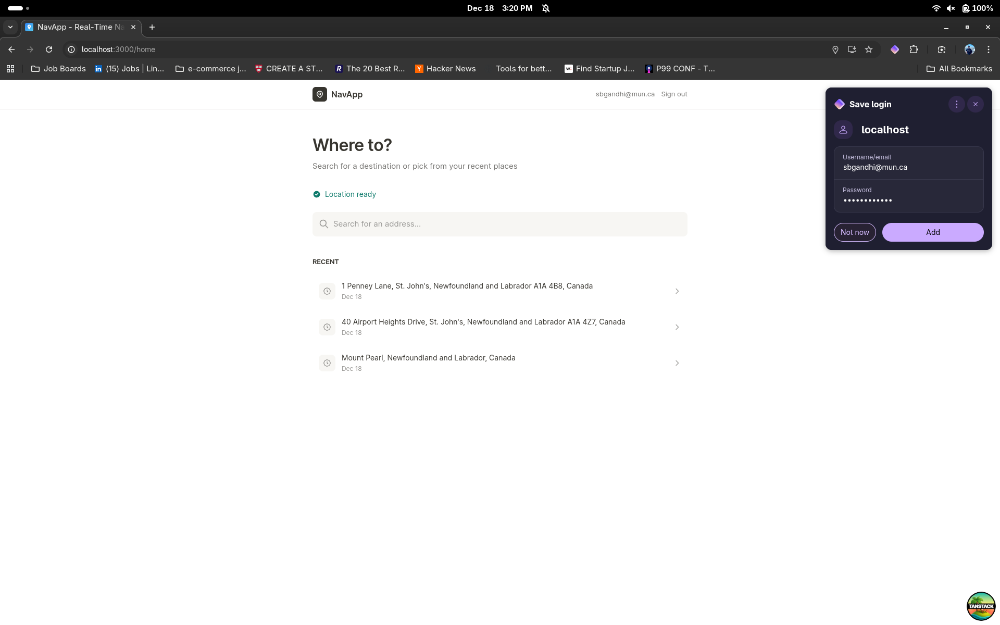
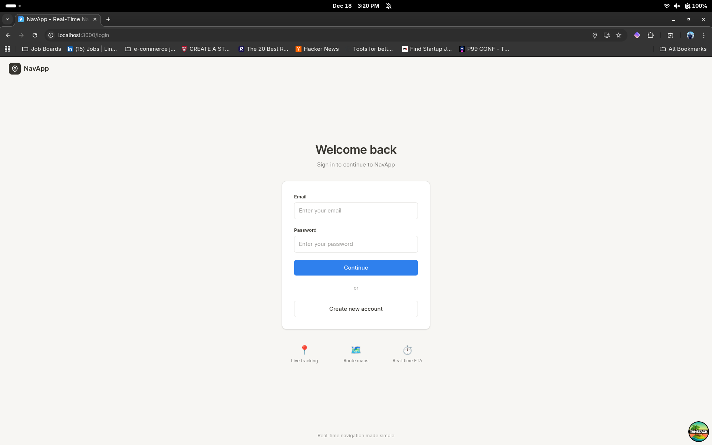
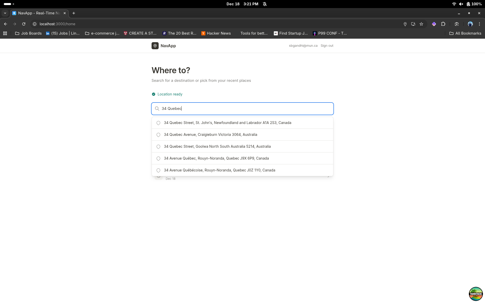
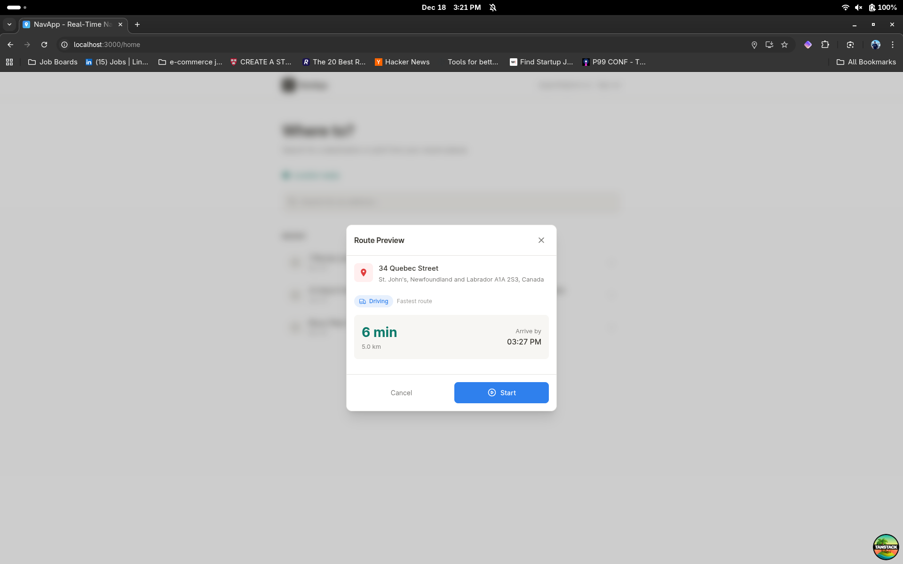
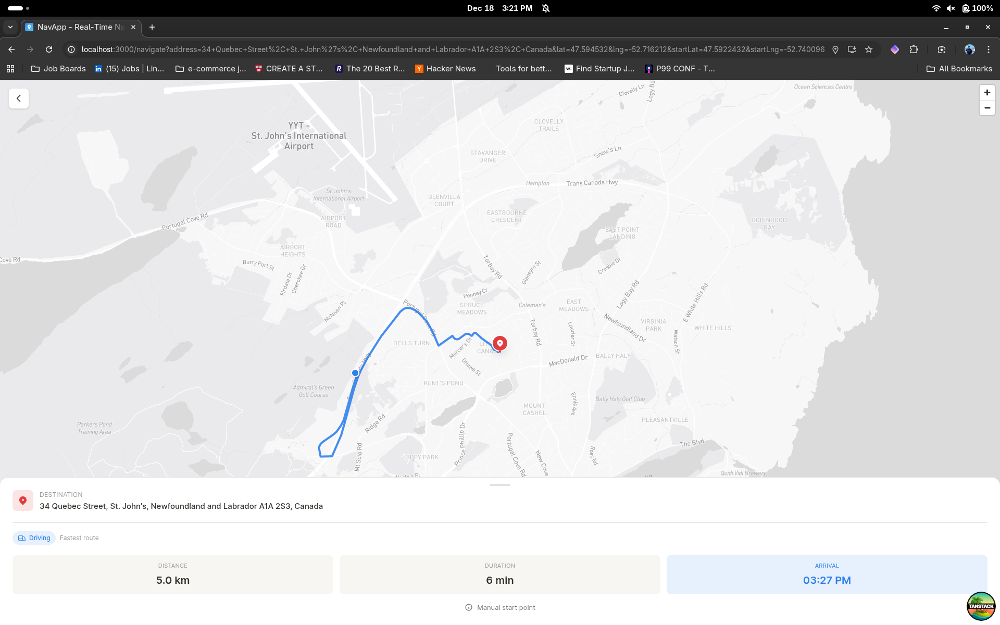
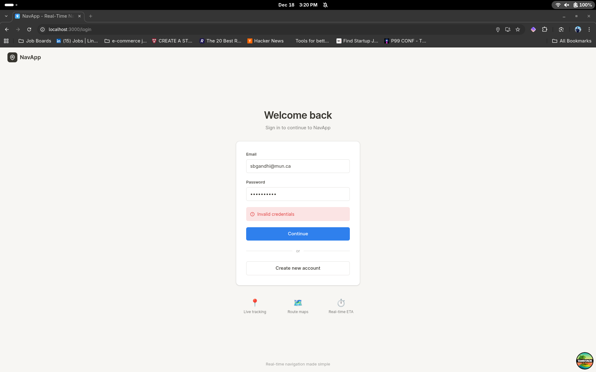

# NavApp 🗺️

Real-time navigation web application with live GPS tracking, distance calculations, and ETA.


<p align="center">
  <a href="https://navapp.fly.dev" target="_blank" style="display: inline-block; padding: 1em 2em; font-size: 1.25em; font-weight: bold; color: white; background: #2F80ED; border-radius: 8px; text-decoration: none; box-shadow: 0 2px 8px rgba(0,0,0,0.12);">
    Try the NavApp Live Demo
  </a>
</p>

## Features

- **User Authentication** - Register, login, secure sessions
- **Live GPS Tracking** - Real-time location updates
- **Address Search** - Autocomplete powered by Mapbox
- **Interactive Maps** - Route visualization with Mapbox GL
- **Real-time ETA** - Distance and arrival time calculations
- **Address History** - Quick access to recent destinations
- **Driving Directions** - Optimal route calculation

## Tech Stack

| Frontend        | Backend     |
| --------------- | ----------- |
| React           | Express.js  |
| TanStack Router | PostgreSQL  |
| TanStack Query  | Drizzle ORM |
| Mapbox GL       | JWT Auth    |
| Tailwind CSS    | TypeScript  |

## Quick Start

### Prerequisites

- Node.js 18+ or [Bun](https://bun.sh)
- PostgreSQL database ([Supabase](https://supabase.com))
- [Mapbox](https://mapbox.com) account

### 1. Clone & Install

```bash
git clone <your-repo-url>
cd navapp

# Install all dependencies
bun install
cd frontend && bun install && cd ..
```

### 2. Configure Environment

**Backend** (`server/.env`):

```env
PORT=8080
DATABASE_URL=postgresql://...
JWT_SECRET=your-secret-key
MAPBOX_ACCESS_TOKEN=sk.xxx
FRONTEND_URL=http://localhost:3000
```

**Frontend** (`frontend/.env`):

```env
VITE_API_URL=http://localhost:8080
VITE_MAPBOX_TOKEN=pk.xxx
VITE_SUPABASE_URL=https://xxx.supabase.co
VITE_SUPABASE_ANON_KEY=xxx
```

### 3. Setup Database

```bash
bun run db:push
```

### 4. Run Development Servers

**Terminal 1 - Backend:**

```bash
bun dev
```

**Terminal 2 - Frontend:**

```bash
cd frontend && bun dev
```

- Frontend: http://localhost:3000
- Backend: http://localhost:8080

## Project Structure

```
navapp/
├── frontend/           # React frontend
│   ├── src/
│   │   ├── routes/     # Pages
│   │   ├── hooks/      # Custom hooks
│   │   ├── components/ # UI components
│   │   └── lib/        # Utilities
│   └── public/         # Static assets
│
├── server/             # Express backend
│   ├── db/             # Database schema
│   └── routes/         # API endpoints
│
└── drizzle.config.ts   # Database config
```

## API Endpoints

### Authentication

| Method | Endpoint             | Description        |
| ------ | -------------------- | ------------------ |
| POST   | `/api/auth/register` | Create new account |
| POST   | `/api/auth/login`    | Login & get token  |
| GET    | `/api/auth/me`       | Get current user   |

### Addresses

| Method | Endpoint             | Description                |
| ------ | -------------------- | -------------------------- |
| GET    | `/api/addresses`     | Get user's saved addresses |
| POST   | `/api/addresses`     | Save new address           |
| DELETE | `/api/addresses/:id` | Delete address             |

### Mapbox Proxy

| Method | Endpoint                                     | Description      |
| ------ | -------------------------------------------- | ---------------- |
| GET    | `/api/geocode?q=query`                       | Search addresses |
| GET    | `/api/route?startLat&startLng&endLat&endLng` | Get route        |

## Screenshots

### Landing & Authentication

| Landing Page                    | Login                             | Register                                |
| ------------------------------- | --------------------------------- | --------------------------------------- |
|  |  |  |

### Navigation Flow

| Address Search                            | Route Preview          | Map Navigation                 |
| ----------------------------------------- | ---------------------- | ------------------------------ |
|  |  |  |

### Auth Check


